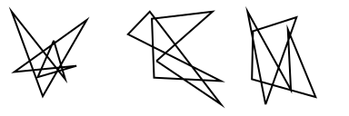
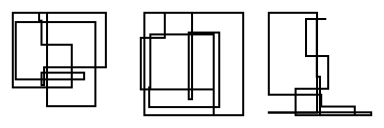
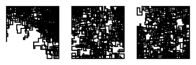
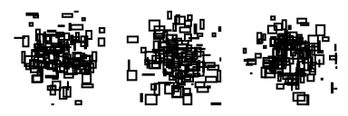

# nuunamnir.georg-nees
## Description
Scripts that generate images according to the rules published by Georg Nees in rot 19 computer-grafik (1962).
## Installation and Requirements
Make sure to have a Python interpreter installed. Then, just clone this repository and get the dependencies via pip.
```
cd nuunamnir.georg-nees
pip install -r requirements.txt
```
## Usage
Run the Python script with the desired parameters. See examples section for possible parameter values.
```
cd src
python generate.py [-h] [-r {0,1,2}] [--width WIDTH] [--height HEIGHT] [-d {uniform,exponential,normal}] [-s SEED] [-p PADDING] [-n N] output
```
## Examples
### 8-ecke
```
python generate.py -r 0 --width 128 --height 128 -d uniform -s 2106 -p 0.1 -n "(3,1)" ../examples/example00.svg
```

### 23-ecke
```
python generate.py -r 1 --width 128 --height 128 -d uniform -s 2106 -p 0.1 -n "(3,1)" ../examples/example01.svg
```

### achsenparalleler irrweg
```
python generate.py -r 2 --width 128 --height 128 -d uniform -s 2106 -p 0.1 -n "(3,1)" ../examples/example02.svg
```


```
python generate.py -r 2 --width 128 --height 128 -d normal -x p=129,l=0.1,mode=rectangle -s 2106 -p 0.1 -n "(3,1)" ../examples/example03.svg
```

### andreaskreuz
```
python generate.py -r 3 -n "(3,1)" --width 128 --height 128 -d uniform ../examples/example04.svg
```

### gardinen
```
python generate.py -r 4 -n "(3,1)" --width 128 --height 128 -d normal ../examples/example05.svg
```
